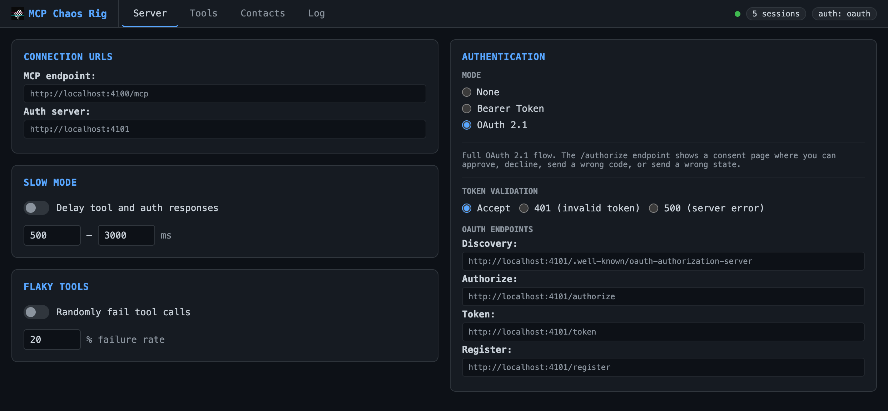
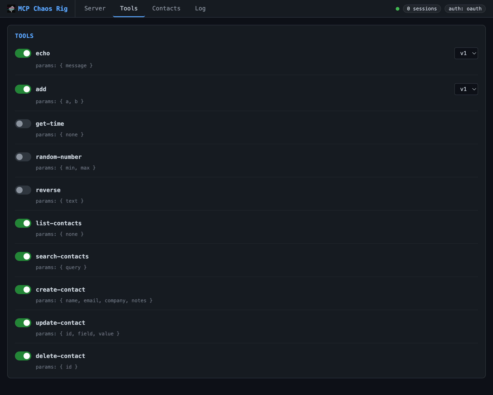
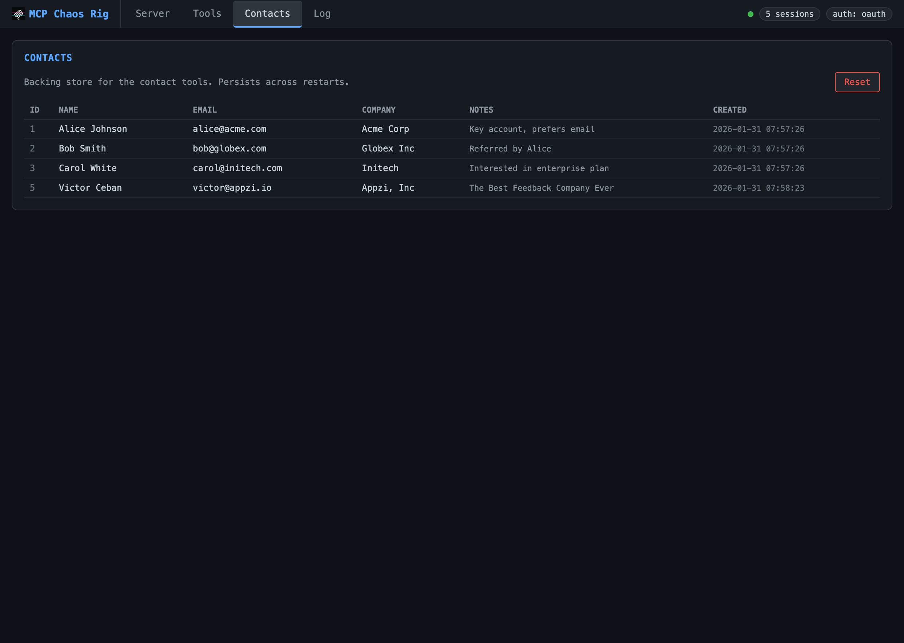
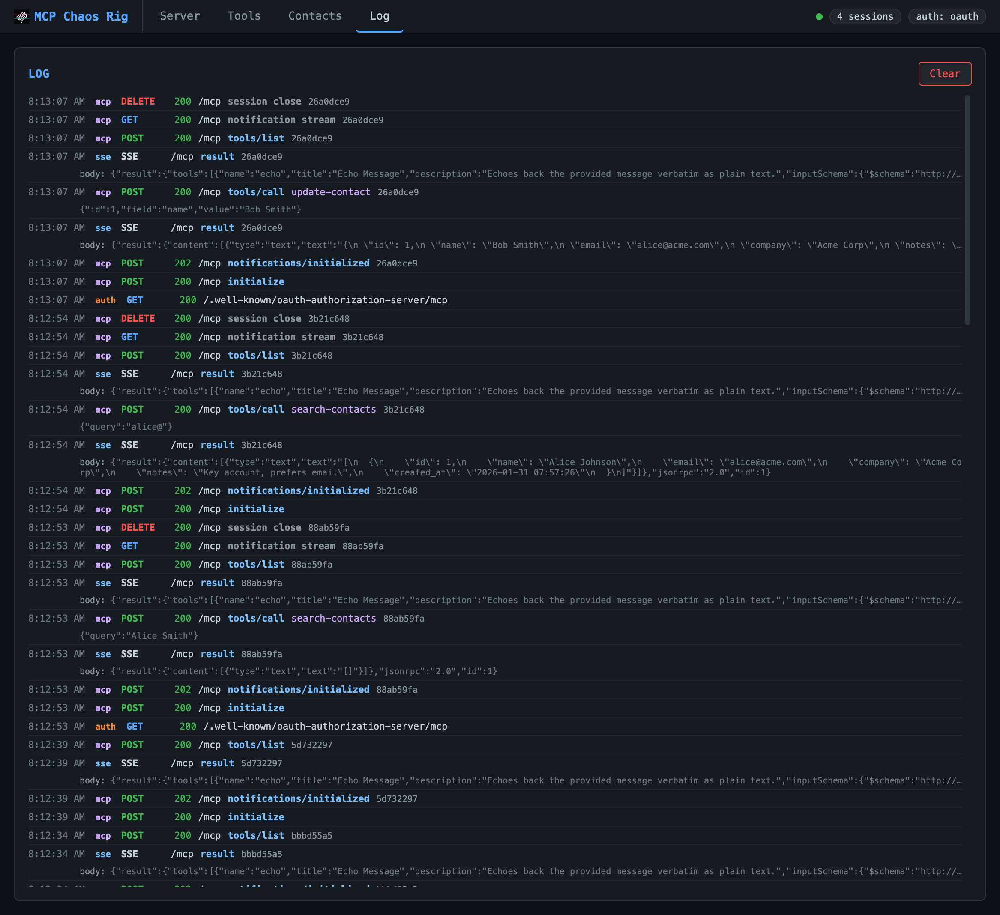
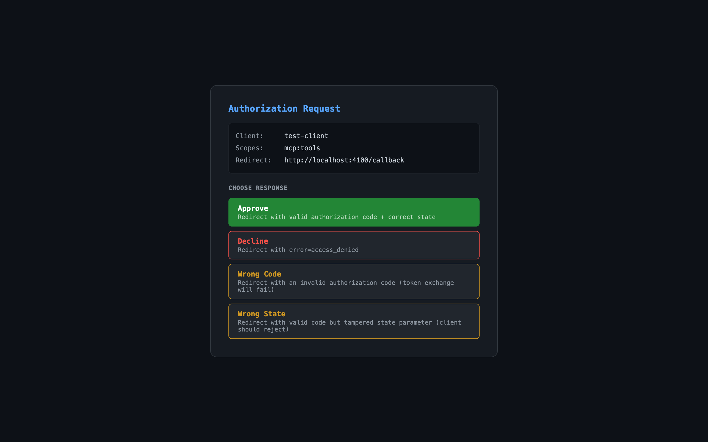

<p align="center">
  
</p>

<h1 align="center">MCP Chaos Rig</h1>

<p align="center">A local MCP server that breaks on demand. Test your client against auth failures, disappearing tools, flaky responses, and token expiry, all from a web UI.</p>

<p align="center">
  <a href="https://www.npmjs.com/package/mcp-chaos-rig"></a>
  <a href="https://github.com/Typewise/mcp-chaos-rig/blob/main/LICENSE"></a>
  <a href="https://www.npmjs.com/package/mcp-chaos-rig"></a>
</p>

---

## The problem

You're building an MCP client. You need to test OAuth flows, token refresh, tool discovery, error handling, and session lifecycle. Production servers don't fail on command. You need a server that does.

## What Chaos Rig does

Run a local MCP server where you control everything:

- **Break authentication**: force 401s and 500s mid-session, expire tokens on demand, reject refresh tokens
- **Break tools**: disable tools to trigger `tools/changed`, switch schema versions live
- **Break reliability**: add random latency, make tool calls fail at configurable rates
- **See everything**: live request log shows inbound JSON-RPC calls and outbound SSE responses, with click-to-expand bodies



### Test scenarios

| Scenario                    | How to test it                                                                   |
| --------------------------- | -------------------------------------------------------------------------------- |
| OAuth 2.1 consent flow      | Use the interactive consent page: approve, decline, invalid code, tampered state |
| Token rejection mid-session | Toggle "Reject OAuth" to 401 or 500 while client is connected                    |
| Token expiry and refresh    | Set access token TTL to a short value, watch the client refresh                  |
| Reject refresh tokens       | Toggle "Reject refresh tokens" to force re-authentication                        |
| Tool disappearing           | Disable a tool in the Tools tab. Clients receive `tools/changed`                 |
| Tool schema changing        | Switch echo or add between v1 and v2 schemas                                     |
| Flaky tool calls            | Set failure rate 0-100%. Failed calls return `isError: true`                     |
| Slow responses              | Enable slow mode with configurable latency range                                 |
| PKCE code exchange          | OAuth consent page offers "Wrong Code" and "Wrong State" options                 |
| Database-backed tools       | CRUD operations on a real SQLite contact database                                |

---

## Quick start

```bash
npx mcp-chaos-rig
```

Control panel at [localhost:4100/ui](http://localhost:4100/ui), MCP endpoint at `http://localhost:4100/mcp`. Requires Node 20+.

If you prefer a global install:

```bash
npm install -g mcp-chaos-rig
mcp-chaos-rig
```

Or run from source:

```bash
git clone https://github.com/Typewise/mcp-chaos-rig.git
cd mcp-chaos-rig
npm install
npm run dev
```

### Remote access

If your production environment needs to reach Chaos Rig, expose it via a tunnel (ngrok, Cloudflare Tunnel, etc.) and set `BASE_URL` so OAuth redirects resolve correctly:

```bash
BASE_URL=https://your-tunnel.example.dev npx mcp-chaos-rig
```

### Auth state

All auth state lives in memory and resets on restart. Bearer mode starts with token `test-token-123` (no expiry — valid until changed). OAuth access tokens expire based on the TTL you configure. Refresh tokens are not tracked — any value produces a fresh access token. Use the "Reject refresh tokens" toggle to test failure scenarios.

---

## Control panel tabs

### Server

Configure auth mode, slow mode (random latency), and flaky tools (% failure rate).

| Auth mode | Behavior                                              |
| --------- | ----------------------------------------------------- |
| None      | All requests pass through                             |
| Bearer    | Requires `Authorization: Bearer test-token-123`       |
| OAuth 2.1 | Full authorization flow with interactive consent page |

Bearer and OAuth modes support fault injection: force 401 or 500 responses to test error handling.

OAuth mode adds controls for access token TTL and refresh token rejection. OAuth endpoints are listed in a collapsible section.

### Tools



Toggle tools on/off. Disabling sends `tools/changed` to connected clients. Some tools (echo, add) support version switching.

**Available tools:**

- `echo`: returns your message (v2 adds format options)
- `add`: sums two numbers (v2 accepts an array)
- `get-time`: current server time as ISO 8601
- `random-number`: random integer in a range
- `reverse`: reverses a string
- `list-contacts`, `search-contacts`, `create-contact`, `update-contact`, `delete-contact`: SQLite CRUD

### Contacts



View and reset the SQLite database backing the contact tools. Starts with three seed records.

### Log



Live request log showing inbound requests and outbound SSE responses. Displays timestamp, source (mcp/auth/sse), method, status, JSON-RPC method, tool name, and arguments. Click any truncated body or args line to expand it. Keeps last 200 entries.

---

## OAuth consent page



When auth mode is OAuth, the authorization endpoint shows an interactive consent page:

| Button      | Result                                             |
| ----------- | -------------------------------------------------- |
| Approve     | Redirects with valid authorization code            |
| Decline     | Redirects with `error=access_denied`               |
| Wrong Code  | Redirects with invalid code (token exchange fails) |
| Wrong State | Redirects with tampered state parameter            |

---

## Links

- [npm package](https://www.npmjs.com/package/mcp-chaos-rig)
- [GitHub repository](https://github.com/Typewise/mcp-chaos-rig)
- [MIT License](LICENSE)
